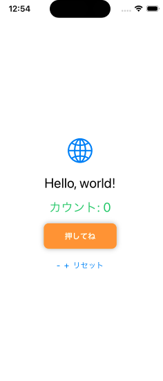
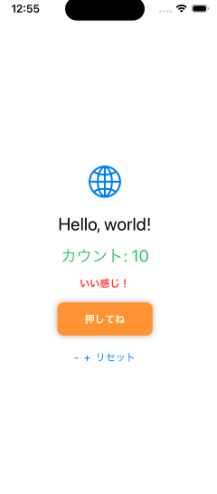
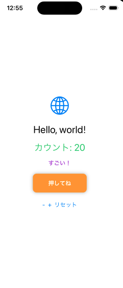

# Swift Counter App

SwiftUIで作成したシンプルなカウンターアプリです。
状態に応じてUIが変化する仕組みを実装しています。

## 特徴
- シンプルなUI設計
- 状態管理による動的表示

## 機能
- カウントの増減
- リセット機能
- カウントに応じたメッセージ表示
  - 10以上：「いい感じ！」
  - 20以上：「すごい！」

## 技術
- SwiftUI
- State管理

## 画面

## 今後の改善
- データ保存機能の追加
- UIの改善
- アニメーション強化
